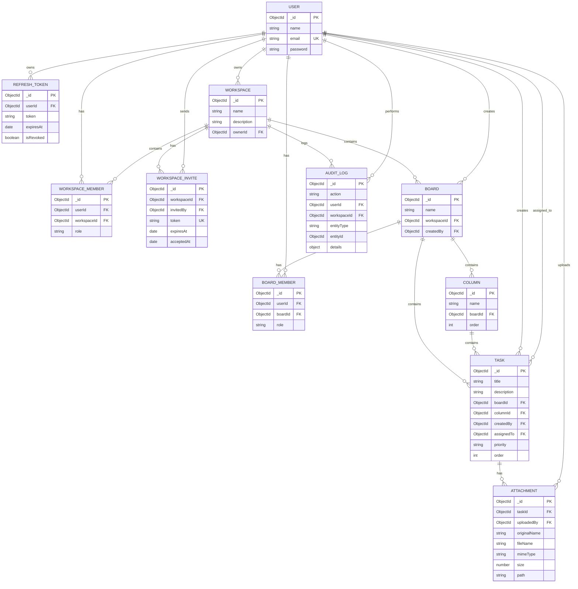

# ER Diagram — Mini SaaS (Notion + Trello + Slack)

Generated from the actual Mongoose models: `User`, `RefreshToken`, `Workspace`,
`WorkspaceMember`, `WorkspaceInvite`, `Board`, `BoardMember`, `Column`, `Task`,
`Attachment`, `AuditLog`.

> This block renders automatically as a diagram on GitHub (README/markdown viewers
> that support Mermaid). If viewing elsewhere, see `ER_Diagram.png` in this folder.

## Relationship notes

- **User → Workspace / Board** (`ownerId` / `createdBy`): one user can own many
  workspaces and create many boards.
- **WorkspaceMember / BoardMember**: join collections carrying `role`
  (`owner`/`member`) — implements RBAC at both the workspace and board level.
- **Board.members[]** also embeds an array of `User` refs directly on the board
  document. This overlaps with `BoardMember` and should be reconciled — either
  drop the embedded array in favor of `BoardMember`, or document why both exist.
- **Column.name** is a fixed enum (`To do`, `In progress`, `Review`, `Done`),
  so columns are stage-based rather than freely renamable lists.
- **Task**: belongs to one `Board` and one `Column`; has a creator
  (`createdBy`) and an optional assignee (`assignedTo`), both referencing `User`.
- **Attachment**: always tied to one `Task` and the `User` who uploaded it.
- **AuditLog**: references `User` and `Workspace` directly, but `entityId` is a
  polymorphic reference (resolved via the `entityType` enum: `BOARD` or `TASK`)
  rather than a formal Mongoose `ref` — not drawable as a single FK line.