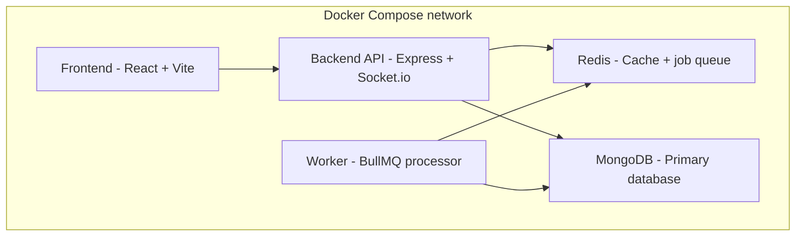
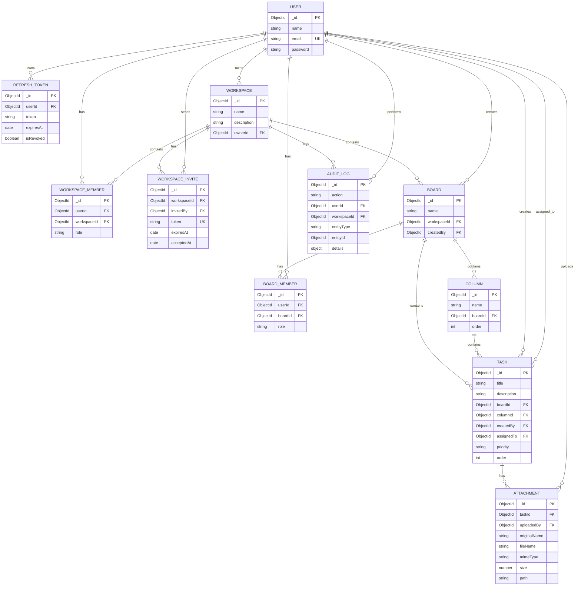

# Mini SaaS Project Management Tool

A Trello + Notion + Slack inspired collaboration app, built as a Senior Full
Stack Developer assignment. Supports workspaces, boards, columns, tasks,
attachments, real-time updates, and role-based access control.

## Tech stack

- **Backend:** Node.js, Express, MongoDB (Mongoose), Redis, BullMQ, Socket.io
- **Auth:** JWT (access + refresh tokens), RBAC
- **Frontend:** React + Vite, Redux Toolkit / Zustand, React Hook Form
- **DevOps:** Docker, Docker Compose, GitHub Actions, Swagger/OpenAPI

## Features

- JWT authentication with refresh token rotation
- Role-based access control at workspace and board level
- Workspaces → Boards → Columns → Tasks hierarchy
- Task attachments, priorities, and audit logging
- Drag-and-drop task management with real-time synchronization
- Background jobs via BullMQ, caching via Redis
- Swagger-documented REST API

## Application Flow

1. **Register**
   - A new user creates an account.

2. **Login**
   - The user logs in and receives access and refresh tokens.

3. **Workspace membership**
   - If the user already belongs to a workspace, they can access the workspace dashboard.
   - If the user does not belong to a workspace, they can create a new workspace.
   - The user who creates a workspace automatically becomes its **owner**.

4. **Workspace → Board → Column → Task**
   - Workspace owners and members can work with boards according to their permissions.
   - Boards contain columns, and columns contain tasks.
   - Tasks can be assigned to workspace members.

5. **Real-time collaboration**
   - Changes are propagated to connected users through Socket.io.


## Authorization & RBAC

The application uses JWT authentication combined with workspace-level and
board-level authorization.


### Board permissions

| Action | Who can perform it |
|---|---|
| Update board | Any member of the board |
| Delete board | Workspace owner or board creator |

The board creator is automatically added as a board member when the board
is created. Other users must be explicitly added as board members.

### Task permissions

| Action | Who can perform it |
|---|---|
| Update task | Any member of the workspace containing the task's board |
| Delete task | Workspace owner, board creator, or task creator |

### Board update

A user must be an active member of the board to update it.

### Board deletion

Only the following users can delete a board:

- Workspace owner
- Board creator

Regular board members cannot delete a board.

Deleting a board also removes its associated columns, tasks, and attachments.

### Task update

Any active member of the workspace containing the task's board can update:

- Task title
- Description
- Priority
- Assignee

### Task deletion

Task deletion is restricted to:

- Workspace owner
- Board creator
- Task creator


## Real-Time Collaboration

The application uses Socket.io to provide real-time collaboration between
users working on the same board.

- When a task is moved between columns using drag-and-drop, the change is
  broadcast to other connected users of baord.
- Connected users receive real-time task movement updates without refreshing
  the page.
- This keeps the board state synchronized across multiple users.

# Development Note

- The React UI styling was developed with assistance from Chat AI.

## Architecture diagram

All services run as separate Docker containers, orchestrated via Docker Compose.

                         ┌──────────────────────┐
                         │        USER          │
                         │   Browser / Client   │
                         └──────────┬───────────┘
                                    │
                                    │ HTTP / HTTPS
                                    ▼
                    ┌─────────────────────────────┐
                    │          FRONTEND           │
                    │       React Application     │
                    │                             │
                    │  Pages / Components / API   │
                    └─────────────┬───────────────┘
                                  │
                                  │ REST API
                                  ▼
                    ┌─────────────────────────────┐
                    │          BACKEND            │
                    │      Node.js + Express      │
                    │                             │
                    │ ┌─────────────────────────┐ │
                    │ │ Routes                  │ │
                    │ │ Controllers             │ │
                    │ │ Middleware              │ │
                    │ │ Services                │ │
                    │ │ Authentication          │ │
                    │ └────────────┬────────────┘ │
                    └──────────────┼──────────────┘
                                   │
                                   │ Mongoose
                                   ▼
                    ┌─────────────────────────────┐
                    │          DATABASE           │
                    │           MongoDB           │
                    │                             │
                    │ Users / Teams / Projects    │
                    │ Tasks / etc.                │
                    └─────────────────────────────┘


             ┌─────────────────────────────────────────┐
             │              DEVELOPMENT                │
             │                                         │
             │ Git Repository                          │
             │          │                              │
             │          ▼                              │
             │    GitHub Actions                       │
             │          │                              │
             │     ┌────┴─────┐                        │
             │     │          │                        │
             │     ▼          ▼                        │
             │ Backend CI   Frontend CI                 │
             │     │          │                        │
             │     └────┬─────┘                        │
             │          ▼                              │
             │     Tests / Build                       │
             └─────────────────────────────────────────┘


                    ┌─────────────────────────┐
                    │         DOCKER          │
                    │                         │
                    │  Backend Container      │
                    │          │              │
                    │          ▼              │
                    │  MongoDB Container      │
                    │                         │
                    │   docker-compose.yml    │
                    └─────────────────────────┘




## ER diagram



## Getting started

### Prerequisites

Before running the project, make sure you have the following installed:

* **Docker Desktop** — required to run the application containers.
* **Git** — required to clone the repository.

The project uses Docker Compose to run the required services, including:

* Frontend
* Backend API
* MongoDB
* Redis
* Background worker
* Mongo Express

You do **not** need to install MongoDB or Redis separately on your machine.

## Quick Start (Single Command)

The project is preconfigured with zero-config development defaults. To run everything right after cloning:

```bash
# Clone and navigate into the repository
git clone <your-repo-url>
cd <your-repo-folder>

# Build and start all 6 services with a single command
docker compose up --build
```

> [!NOTE]
> Creating local `.env` files is completely **optional**. `docker-compose.yml` includes safe development defaults for all services out-of-the-box. If you wish to customize secrets, ports, or URLs, copy the example files:
> ```bash
> cp backend/.env.example backend/.env
> cp frontend/.env.example frontend/.env
> ```

The application will be available at:

* Frontend: `http://localhost:5173`
* Backend API: `http://localhost:5000`
* Mongo Express: `http://localhost:8081`

To stop the application:

```bash
docker compose down
```


### Docker setup

Everything — frontend, backend API, background worker, Redis, and MongoDB —
runs as containers via Docker Compose. No local Node/Mongo/Redis install needed.

```bash
docker-compose up --build
```

This spins up:
- `frontend` — React + Vite SPA (port 5173)
- `api` — Express REST API + Socket.io server (port 5000)
- `worker` — BullMQ background job processor
- `redis` — Cache and job queue (port 6379)
- `mongo` — Primary database with replica set (port 27017)
- `mongo-express` — Web-based MongoDB management GUI (port 8081)

## Environment variables

### Backend (`backend/.env`)

| Variable | Description | Default / Example |
|---|---|---|
| `PORT` | Port for the Express server | `5000` |
| `NODE_ENV` | Environment mode (`development` / `production`) | `development` |
| `MONGO_URI` | MongoDB connection URI with replica set | `mongodb://mongodb:27017/workspace` |
| `ACCESS_TOKEN_SECRET` | Secret key for signing short-lived JWT access tokens | `your_super_secret_access_token_key_here` |
| `REFRESH_TOKEN_SECRET` | Secret key for signing long-lived JWT refresh tokens | `your_super_secret_refresh_token_key_here` |
| `FRONTEND_URL` | Frontend origin for CORS and cookie handling | `http://localhost:5173` |

### Frontend (`frontend/.env`)

| Variable | Description | Default / Example |
|---|---|---|
| `VITE_BACKEND_URI` | Backend API base URL accessed by the client browser | `http://localhost:5000` |

## API documentation

Once the server is running locally, interactive Swagger UI and the raw OpenAPI spec are available at:

```bash
http://localhost:5000/api/docs — interactive Swagger UI
http://localhost:5000/api/docs/swagger.json — raw OpenAPI spec (JSON)
```

## Testing
Run the backend test suite inside the Docker container:
```bash
docker compose exec api npm test
```

## Project structure

```text
.
├── .github/
│   └── workflows/          # GitHub Actions CI/CD pipelines (backend & frontend)
├── backend/
│   ├── src/                # Route handlers, models, middleware, services, docs
│   ├── tests/              # Test suites (Jest + Supertest)
│   ├── coverage/           # Test coverage reports
│   ├── uploads/            # Local file upload storage
│   ├── app.js              # Express app setup & middleware
│   ├── index.js            # Server entry point & Socket.io server
│   ├── Dockerfile          # Backend container definition
│   ├── nodemon.json        # Nodemon configuration
│   ├── package.json        # Backend dependencies & scripts
│   └── .env.example        # Backend sample environment variables
├── frontend/
│   ├── src/                # React components, pages, hooks, sockets, API
│   ├── public/             # Static assets
│   ├── Dockerfile          # Frontend container definition (Vite dev)
│   ├── eslint.config.js    # ESLint configuration
│   ├── vite.config.js      # Vite configuration
│   ├── package.json        # Frontend dependencies & scripts
│   └── .env.example        # Frontend sample environment variables
├── docker-compose.yml      # Orchestrates all containers
├── ER_DIAGRAM.md           # Entity Relationship diagram documentation
└── README.md
```