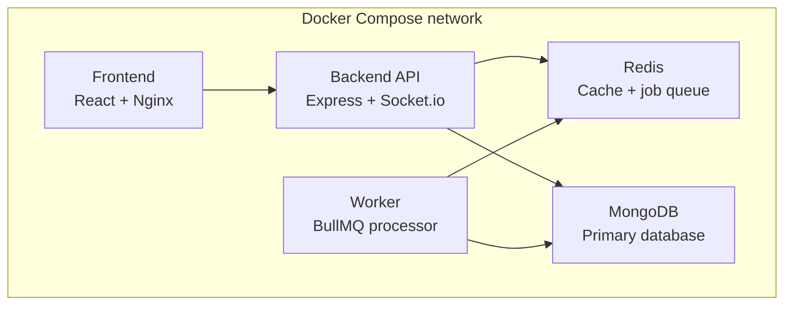

# Mini SaaS Project Management Tool

A Trello + Notion + Slack inspired collaboration app, built as a Senior Full
Stack Developer assignment. Supports workspaces, boards, columns, tasks,
attachments, real-time updates, and role-based access control.

## Tech stack

- **Backend:** Node.js, Express, MongoDB (Mongoose), Redis, BullMQ, Socket.io
- **Auth:** JWT (access + refresh tokens), RBAC
- **Frontend:** React + Vite, Redux Toolkit / Zustand, React Hook Form
- **DevOps:** Docker, Docker Compose, GitHub Actions, Swagger/OpenAPI

## Features

- JWT authentication with refresh token rotation
- Role-based access control at workspace and board level
- Workspaces → Boards → Columns → Tasks hierarchy
- Task attachments, priorities, and audit logging
- Real-time updates via Socket.io
- Background jobs via BullMQ, caching via Redis
- Swagger-documented REST API

## Architecture diagram

All services run as separate Docker containers, orchestrated via Docker Compose.

                         ┌──────────────────────┐
                         │        USER          │
                         │   Browser / Client   │
                         └──────────┬───────────┘
                                    │
                                    │ HTTP / HTTPS
                                    ▼
                    ┌─────────────────────────────┐
                    │          FRONTEND           │
                    │       React Application     │
                    │                             │
                    │  Pages / Components / API   │
                    └─────────────┬───────────────┘
                                  │
                                  │ REST API
                                  ▼
                    ┌─────────────────────────────┐
                    │          BACKEND            │
                    │      Node.js + Express      │
                    │                             │
                    │ ┌─────────────────────────┐ │
                    │ │ Routes                  │ │
                    │ │ Controllers             │ │
                    │ │ Middleware              │ │
                    │ │ Services                │ │
                    │ │ Authentication          │ │
                    │ └────────────┬────────────┘ │
                    └──────────────┼──────────────┘
                                   │
                                   │ Mongoose
                                   ▼
                    ┌─────────────────────────────┐
                    │          DATABASE           │
                    │           MongoDB           │
                    │                             │
                    │ Users / Teams / Projects    │
                    │ Tasks / etc.                │
                    └─────────────────────────────┘


             ┌─────────────────────────────────────────┐
             │              DEVELOPMENT                │
             │                                         │
             │ Git Repository                          │
             │          │                              │
             │          ▼                              │
             │    GitHub Actions                       │
             │          │                              │
             │     ┌────┴─────┐                        │
             │     │          │                        │
             │     ▼          ▼                        │
             │ Backend CI   Frontend CI                 │
             │     │          │                        │
             │     └────┬─────┘                        │
             │          ▼                              │
             │     Tests / Build                       │
             └─────────────────────────────────────────┘


                    ┌─────────────────────────┐
                    │         DOCKER          │
                    │                         │
                    │  Backend Container      │
                    │          │              │
                    │          ▼              │
                    │  MongoDB Container      │
                    │                         │
                    │   docker-compose.yml    │
                    └─────────────────────────┘




## ER diagram


## Getting started

### Prerequisites

- Node.js (v18+)
- MongoDB
- Redis
- Docker & Docker Compose (optional, for containerized setup)

### Local setup

```bash
# clone the repo
git clone <your-repo-url>
cd <your-repo-folder>

# install dependencies
npm install

# copy env file and fill in values
cp .env.example .env

# run the dev server
npm run dev
```

### Docker setup

Everything — frontend, backend API, background worker, Redis, and MongoDB —
runs as containers via Docker Compose. No local Node/Mongo/Redis install needed.

```bash
docker-compose up --build
```

This spins up:
- `frontend` — React app served via Nginx
- `api` — Express REST API + Socket.io server
- `worker` — BullMQ background job processor
- `redis` — cache and job queue
- `mongo` — primary database

## Environment variables

<!-- List your actual required env vars here -->
```
MONGO_URI=
REDIS_URL=
ACCESS_TOKEN_SECRET=
REFRESH_TOKEN_SECRET=
PORT=
```

## API documentation

Swagger UI is available at `/api-docs` once the server is running.

## Testing

```bash
npm run test
```

## Project structure

<!-- Adjust to match your actual folder layout -->
```
src/
  models/       # Mongoose schemas
  routes/       # Express routes
  controllers/  # Route handlers
  middleware/   # Auth, RBAC, error handling
  services/     # Business logic, BullMQ jobs
  sockets/      # Socket.io handlers
```