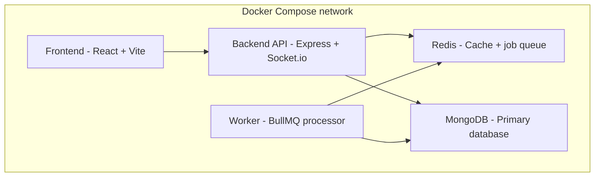

# Mini SaaS Project Management Tool

A Trello + Notion + Slack inspired collaboration app, built as a Senior Full
Stack Developer assignment. Supports workspaces, boards, columns, tasks,
attachments, real-time updates, and role-based access control.

## Tech stack

- **Backend:** Node.js, Express, MongoDB (Mongoose), Redis, BullMQ, Socket.io
- **Auth:** JWT (access + refresh tokens), RBAC
- **Frontend:** React + Vite, Redux Toolkit / Zustand, React Hook Form
- **DevOps:** Docker, Docker Compose, GitHub Actions, Swagger/OpenAPI

## Features

- JWT authentication with refresh token rotation
- Role-based access control at workspace and board level
- Workspaces → Boards → Columns → Tasks hierarchy
- Task attachments, priorities, and audit logging
- Real-time updates via Socket.io
- Background jobs via BullMQ, caching via Redis
- Swagger-documented REST API

## Architecture diagram

All services run as separate Docker containers, orchestrated via Docker Compose.

                         ┌──────────────────────┐
                         │        USER          │
                         │   Browser / Client   │
                         └──────────┬───────────┘
                                    │
                                    │ HTTP / HTTPS
                                    ▼
                    ┌─────────────────────────────┐
                    │          FRONTEND           │
                    │       React Application     │
                    │                             │
                    │  Pages / Components / API   │
                    └─────────────┬───────────────┘
                                  │
                                  │ REST API
                                  ▼
                    ┌─────────────────────────────┐
                    │          BACKEND            │
                    │      Node.js + Express      │
                    │                             │
                    │ ┌─────────────────────────┐ │
                    │ │ Routes                  │ │
                    │ │ Controllers             │ │
                    │ │ Middleware              │ │
                    │ │ Services                │ │
                    │ │ Authentication          │ │
                    │ └────────────┬────────────┘ │
                    └──────────────┼──────────────┘
                                   │
                                   │ Mongoose
                                   ▼
                    ┌─────────────────────────────┐
                    │          DATABASE           │
                    │           MongoDB           │
                    │                             │
                    │ Users / Teams / Projects    │
                    │ Tasks / etc.                │
                    └─────────────────────────────┘


             ┌─────────────────────────────────────────┐
             │              DEVELOPMENT                │
             │                                         │
             │ Git Repository                          │
             │          │                              │
             │          ▼                              │
             │    GitHub Actions                       │
             │          │                              │
             │     ┌────┴─────┐                        │
             │     │          │                        │
             │     ▼          ▼                        │
             │ Backend CI   Frontend CI                 │
             │     │          │                        │
             │     └────┬─────┘                        │
             │          ▼                              │
             │     Tests / Build                       │
             └─────────────────────────────────────────┘


                    ┌─────────────────────────┐
                    │         DOCKER          │
                    │                         │
                    │  Backend Container      │
                    │          │              │
                    │          ▼              │
                    │  MongoDB Container      │
                    │                         │
                    │   docker-compose.yml    │
                    └─────────────────────────┘




## ER diagram


## Getting started

### Prerequisites

Before running the project, make sure you have the following installed:

* **Docker Desktop** — required to run the application containers.
* **Git** — required to clone the repository.

The project uses Docker Compose to run the required services, including:

* Frontend
* Backend API
* MongoDB
* Redis
* Background worker
* Mongo Express

You do **not** need to install MongoDB or Redis separately on your machine.

## Local Setup

```bash
# Clone the repository
git clone <your-repo-url>
cd <your-repo-folder>

# Create the backend environment file
cp backend/.env.example backend/.env

# Fill in the required environment variables
# Edit backend/.env with your configuration

# Build and start all services
docker compose up --build
```

The application will be available at:

* Frontend: `http://localhost:5173`
* Backend API: `http://localhost:5000`
* Mongo Express: `http://localhost:8081`

To stop the application:

```bash
docker compose down
```


### Docker setup

Everything — frontend, backend API, background worker, Redis, and MongoDB —
runs as containers via Docker Compose. No local Node/Mongo/Redis install needed.

```bash
docker-compose up --build
```

This spins up:
- `frontend` — React app served via Nginx
- `api` — Express REST API + Socket.io server
- `worker` — BullMQ background job processor
- `redis` — cache and job queue
- `mongo` — primary database

## Environment variables

```bash
PORT=
NODE_ENV=
MONGO_URI=
ACCESS_TOKEN_SECRET=
REFRESH_TOKEN_SECRET=
FRONTEND_URL=
```

## API documentation

Once the server is running locally, interactive Swagger UI and the raw OpenAPI spec are available at:

```bash
http://localhost:5000/api/docs — interactive Swagger UI
http://localhost:5000/api/docs/swagger.json — raw OpenAPI spec (JSON)
```

## Testing
Run the backend test suite inside the Docker container:
```bash
docker compose exec api npm test
```

## Project structure

.
├── .github/
│   └── workflows/          # GitHub Actions CI/CD pipelines
├── backend/
│   ├── src/                # Route handlers, models, middleware, services
│   ├── tests/              # Test suites
│   ├── coverage/           # Test coverage reports
│   ├── uploads/            # Local file upload storage
│   ├── app.js               # Express app setup
│   ├── index.js              # Server entry point
│   ├── Dockerfile
│   ├── nodemon.json
│   ├── package.json
│   └── .env.example
├── frontend/                # React + Vite app
├── docker-compose.yml       # Orchestrates all containers
├── ER_DIAGRAM.md
└── README.md